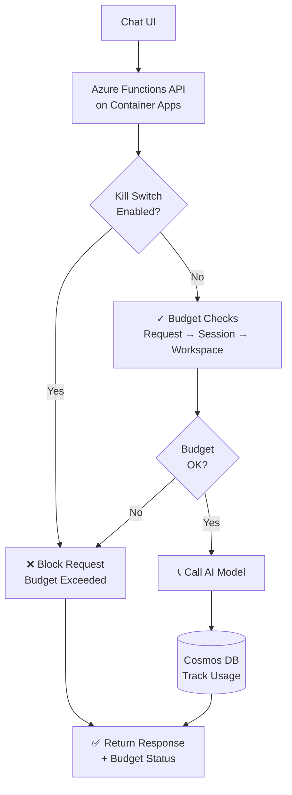

# Demo AI Layered Budget Guardrails

> **Intelligent Cost Management for AI-Powered Applications**

An open-source reference implementation demonstrating **three-layer budget guardrails** for AI chat applications. Built on Azure with production-ready patterns, this project shows how to control AI costs while delivering responsive user experiences.

## Why Budget Guardrails?

AI-powered features are powerful—and expensive. Without controls, model costs can spiral unexpectedly. This project demonstrates a practical approach to cost management:

- **Request-level controls**: Block expensive requests before hitting the model
- **Session-level tracking**: Set cumulative budgets per conversation
- **Workspace-level kill switch**: Automatically halt all AI calls when budget is exceeded
- **Real-time cost visibility**: Users see estimated costs with every interaction

Perfect for:
- Building AI features into SaaS applications
- Controlling costs in development environments
- Learning Azure infrastructure patterns
- Prototyping multi-tenant AI systems

## How It Works



## Three-Layer Budget Architecture

### 1. Request Level
Each chat request is evaluated before calling the model:
- Maximum output tokens
- Estimated cost
- Request timeout
- Input validation

### 2. Session Level
Each conversation session has cumulative limits:
- Total prompt/completion tokens
- Total estimated cost
- Request count
- Session status (active/blocked)

### 3. Workspace Level
Top-level budget scope with automatic kill switch:
- Daily and monthly cost limits
- Total usage tracking
- Emergency kill switch (auto-enabled when budget exceeded)

## Technology Stack

- **API Runtime**: Azure Functions (Python) running on Azure Container Apps
- **AI Model**: Azure OpenAI / Azure AI Foundry
- **Database**: Azure Cosmos DB (NoSQL)
- **Infrastructure as Code**: Bicep
- **Frontend**: React + Vite (optional)
- **Container Registry**: Azure Container Registry
- **CI/CD**: GitHub Actions

## Implementation on Azure

### Architecture Design

The project was built on Azure using a **serverless-first approach** with layered budgeting controls:

1. **Azure Functions as the API core** - Lightweight HTTP triggers handle chat requests, avoiding heavy VM overhead
2. **Container Apps for runtime flexibility** - Enables containerized Functions to scale independently
3. **Cosmos DB for distributed budgeting** - NoSQL design with workspace partitioning supports multi-tenant scenarios and real-time tracking
4. **Managed Identity for security** - Eliminates credential management and reduces attack surface
5. **Key Vault for secrets** - Centralized configuration management with rotation capabilities

### Budget Guard Implementation

The three-layer guardrail system was implemented through:

- **Request validation middleware** in the Azure Functions handler that pre-emptively estimates token counts and costs
- **Session state in Cosmos DB** using the `sessions` container to track cumulative usage per conversation
- **Workspace-level kill switch** stored in the `killSwitch` container, checked before every AI call
- **Real-time cost calculation** based on input/output token counts and configurable pricing

## Project Structure

```
demo-ai-layered-budget-guardrails/
├── api/                          # Azure Functions Python app
│   ├── function_app.py          # HTTP route handlers
│   ├── Dockerfile               # Container image
│   ├── requirements.txt          # Python dependencies
│   ├── host.json                # Functions configuration
│   └── services/                # Business logic
│       ├── budget_service.py    # Budget checks and tracking
│       ├── cosmos_service.py    # Cosmos DB access
│       ├── ai_service.py        # AI model integration
│       ├── cost_calculator.py   # Token cost estimation
│       └── models.py            # Data models
│
├── app/
│   └── chat-ui/                 # React chat interface
│       ├── vite.config.ts
│       ├── src/
│       │   ├── App.tsx
│       │   └── components/
│       └── package.json
│
├── infra/                        # Infrastructure as Code (Bicep)
│   ├── main.bicep              # Main template
│   ├── main.parameters.example.json
│   └── modules/
│       ├── acr.bicep           # Container Registry
│       ├── cosmos.bicep        # Cosmos DB
│       ├── containerapp-function.bicep
│       ├── monitoring.bicep
│       └── role-assignments.bicep
│
└── docs/
    ├── architecture.md         # Detailed architecture
    ├── deployment.md           # Deployment guide
    └── api-endpoints.md        # API reference
```

## API Endpoints

### Chat Endpoint

```
POST /api/chat
```

Send a message and receive AI response with budget status:

```json
{
  "workspaceId": "demo-workspace",
  "sessionId": "session-xyz",
  "message": "Your question here"
}
```

### Admin Endpoints

```
GET  /api/admin/status                    # Health and status
POST /api/admin/kill-switch/enable        # Manually enable kill switch
POST /api/admin/kill-switch/disable       # Disable kill switch
POST /api/admin/budget/reset-demo         # Reset demo workspace
```

All admin endpoints require the `X-Admin-Key` header.

## Database Schema

All data is stored in a single Cosmos DB database with four containers:

| Container | Partition Key | Purpose |
|-----------|---------------|---------|
| `workspaces` | `/workspaceId` | Budget config and workspace settings |
| `sessions` | `/workspaceId` | Conversation session tracking |
| `usageEvents` | `/workspaceId` | Individual AI request logs |
| `killSwitch` | `/workspaceId` | Emergency cost control flag |

**Design Notes**: The `workspaceId` partition key enables efficient queries within a workspace and natural separation in multi-tenant scenarios. This structure allows budget enforcement at three distinct scopes while maintaining efficient database access patterns.

## Cost Model Implementation

Token-based cost calculation was implemented to provide real-time budget feedback:

- **Input tokens**: $0.00005 per 1K tokens
- **Output tokens**: $0.00015 per 1K tokens

Each request goes through a **cost estimator** that:
1. Counts input tokens from the user message
2. Estimates output tokens based on configured limits
3. Calculates USD cost before calling the AI model
4. Deducts from remaining session budget

**Disclaimer**: All cost calculations are estimates. Actual pricing varies by model, region, and Azure commitment. For production, configure pricing explicitly for your chosen model.

## Security Model

The project implements **zero-trust security principles** for Azure:

- **Managed Identity**: The Container App uses a user-assigned managed identity instead of connection strings
- **RBAC Role Assignments**: Fine-grained permissions through Bicep-deployed role assignments
- **Key Vault Integration**: Secrets never appear in configuration files or environment variables
- **Admin Key Protection**: All budget and kill-switch operations require an `X-Admin-Key` header
- **No Hardcoded Credentials**: All examples use sample parameters; secrets are injected at deployment

The infrastructure code demonstrates secure patterns for production Azure deployments.

## Design Patterns & Lessons Learned

### Pattern 1: Layered Validation
Before calling expensive AI models, implement multiple validation layers:
- **Request layer**: Validate input size, format, rate limits
- **Session layer**: Check cumulative session costs
- **Workspace layer**: Enforce organization-wide budgets

This pattern prevents cascading costs when any single layer detects overages.

### Pattern 2: Event-Sourced Budgeting
Every AI interaction creates an immutable `usageEvent` document:
- Audit trail for cost reconciliation
- Historical analysis of budget trends
- Foundation for advanced ML-based forecasting

The `usageEvents` container becomes a ledger rather than just logs.

### Pattern 3: Kill Switch Pattern
A separate `killSwitch` container enables:
- **Fast rejection** of all requests when budget exceeded
- **Granular control** per workspace without code changes
- **Emergency recovery** ability to re-enable after budget reset

This pattern decouples safety enforcement from request logic.

### Pattern 4: Managed Identity in Containers
Using Azure Container Apps with managed identities provides:
- **No credential rotation needed** in application code
- **Audit trail** of which apps accessed what resources
- **Compliance-friendly** for regulated environments

The Bicep templates demonstrate proper RBAC setup for this pattern.

## Key Technical Decisions

**Why Cosmos DB over SQL Database?**  
- Natural fit for hierarchical budget data (workspace → session → events)
- Flexible schema for future extensions (forecasting, anomaly detection)
- Built-in TTL for session cleanup
- Better price-to-performance for this workload

## What This Project Demonstrates

- **Cost-aware application design** in cloud environments
- **Multi-tenant architecture patterns** with Cosmos DB partitioning  
- **Serverless best practices** on Azure
- **Security patterns** with managed identities and RBAC
- **Infrastructure as Code** using Bicep
- **Real-time monitoring** of AI costs
- **Budget enforcement** without code changes (kill switch pattern)

## Contributing

Contributions are welcome! This project aims to be a reference for:

- Azure best practices
- AI cost management strategies  
- Multi-tenant SaaS architecture patterns
- Production-ready Bicep templates

To contribute, please open a GitHub pull request with your enhancements.

## License

This project is licensed under the MIT License. See [LICENSE](LICENSE) for details.

## Learn More

**Explore the Code**: 
- [api/services/budget_service.py](api/services/budget_service.py) - Core budget enforcement logic
- [api/services/cost_calculator.py](api/services/cost_calculator.py) - Token counting and cost estimation  
- [infra/main.bicep](infra/main.bicep) - Azure infrastructure template
- [api/function_app.py](api/function_app.py) - API request handlers

**Azure Documentation**:
- [Azure Functions on Container Apps](https://learn.microsoft.com/en-us/azure/container-apps/functions-app)
- [Cosmos DB Design Patterns](https://learn.microsoft.com/en-us/azure/cosmos-db/concepts-design-patterns)
- [Azure OpenAI Cost Optimization](https://learn.microsoft.com/en-us/azure/ai-services/openai/concepts/tokens)

---

**Built with ❤️ on Azure** | Questions? Open an [issue](https://github.com/navidradkusha/demo-ai-layered-budget-guardrails/issues)
